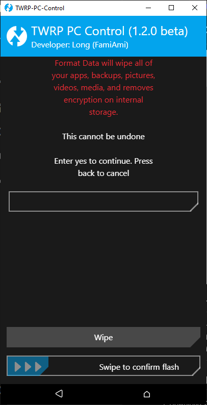

# 🖥️ TWRP PC Control

**TWRP PC Control** is a lightweight tool that allows you to **control TWRP directly from your computer**, designed especially for devices with **broken or unresponsive touchscreens in TWRP**.

---

## 📸 Screenshots

  
  
  
  

## 🚀 Key Features

- 🔗 **Easy ADB connection** – no touchscreen required, works as long as ADB is detected in TWRP.
- 🧭 **Intuitive navigation**: move, select, swipe, go back, confirm... just like using the touchscreen.
- 💾 **Advanced command execution**: install ZIPs, format partitions, mount `/data`, sideload, and more.
- 🪟 **User-friendly interface**: runs on Windows and displays a simple control menu.
- ⚙️ **Flexible customization**: supports sending `openrecoveryscript` or raw `adb shell` commands for advanced users.

---

## 💡 Use Cases

This tool is particularly useful when:

- Your device’s **touchscreen doesn’t work** in TWRP or is broken.
- You want to **control TWRP remotely** without manual touch input.
- You need to **quickly execute recovery commands** (install, wipe, reboot, mount, etc.) without typing them manually in terminal.

---

## 🧰 Requirements

- The device must be **booted into TWRP Recovery**.
- **ADB is enabled** and the computer can detect the device (`adb devices` shows your device).
- Works on **Windows/Linux/macOS** (depending on your build version).

---

## ⚙️ How to Use

1. Download **TWRP PC Control** on your computer.
2. Connect your phone to the computer via USB cable.
3. Open TWRP_PC_Control.exe (portable version, no installation needed).
